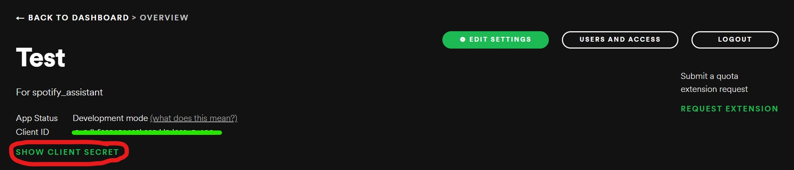
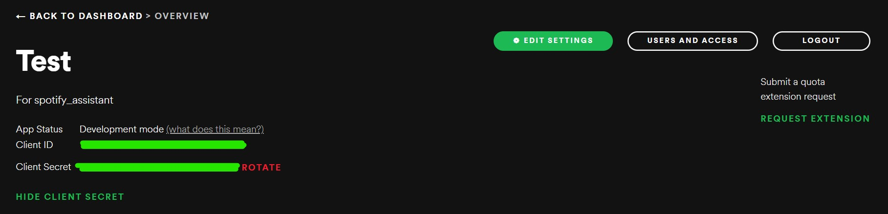

<!-- README.md is generated from README.Rmd. Please edit that file -->

# SpotifyAssistantR

<!-- badges: start -->

[](https://github.com/UBC-MDS/SpotifyAssistantR/actions/workflows/R-CMD-check.yaml)
<!-- badges: end -->

In this project, we aim to create a package in R that builds on top of
the spotifyR package and offers more useful features to improve the
Spotify user experience.

This is achieved by utilizing REST APIs to implement the functions.
Although the spotifyR package consists of wrapper functions for the
Spotify REST APIs, our package will combine multiple requests from the
spotifyR package to provide additional insights for Spotify users.

## Authors

- Caroline Tang
- Chester Wang
- Jenit Jain
- Julie Song

This package was originally created as part of the requirements of
DSCI524 (Collaborative Software Development), a course in the Master of
Data Science program at the University of British Columbia. All original
members of this project abided by the [Code of
Conduct](CODE_OF_CONDUCT.md).

## Installation

You can install the development version of SpotifyAssistantR like so:

``` r
devtools::install_github('UBC-MDS/SpotifyAssistantR')
```

## Dependencies

R (\>=4.1.0)

- spotifyr (2.2.4)

- dplyr

## Environment Setup

Using this package requires Spotify and Spotify Developer accounts,
which you can create on the [Spotify Developer
website](https://developer.spotify.com/dashboard/login). After creating
an account, you will need to create an app to obtain the necessary
client ID and secret in order to authenticate into the Spotify API.


After giving your app a name and description, you should be able to
obtain the client ID and secret from the top of the app overview:


After clicking `SHOW CLIENT SECRET`:



To use the package we require you to supplement the client ID and client
secret as environment variables:

``` r
Sys.setenv(SPOTIFY_CLIENT_ID = 'xxxxxxxxxxxxxxxxxxxxx')
Sys.setenv(SPOTIFY_CLIENT_SECRET = 'xxxxxxxxxxxxxxxxxxxxx')

access_token <- spotifyr::get_spotify_access_token()
authentication_code <- spotifyr::get_spotify_authentication_code()
```

This must be provided after loading the `spotifyr` library and before
using the package.

Running `spotifyr::get_spotify_authentication_code()` should open a new
browser tab that asks for permission for the app to access your
information. If successful, you should get a message that you can close
the tab and return to R.

If this is not the case, you may need to add `http://localhost:1410/` as
a redirect URI in the app, by clicking `Edit Settings` in the app
overview and pasting the URI under `Redirect URIs`. Alternatively, you
may need to rotate the client secret and re-assign
`SPOTIFY_CLIENT_SECRET`.

## Usage

This is a basic example which shows you how to get the new releases in
Asia:

``` r
library(SpotifyAssistantR)

Sys.setenv(SPOTIFY_CLIENT_ID = 'xxxxxxxxxxxxxxxxxxxxx')
Sys.setenv(SPOTIFY_CLIENT_SECRET = 'xxxxxxxxxxxxxxxxxxxxx')

get_new_releases_by_continent(country_code='Asia', n_limit=3)

# [[1]]
# [1] "Renegade"
# 
# [[2]]
# [1] "LANDER"
# 
# [[3]]
# [1] "Dreaming of You"
```

This is a simple example to get song titles from some of your saved
playlists:

``` r
# for one playlist
get_playlists_songs(playlist_names = 'bops')

# [1] "Getting songs for bops"
# $bops
#   [1] "hot girl bummer"                                          
#   [2] "Salt"                                                     
#   [3] "Don't Start Now"  

# for more than one playlist
get_playlists_songs(playlist_names = c('bops', 'night drives'))

# [1] "Getting songs for night drives"
# [1] "Getting songs for bops"
# $`night drives`
#  [1] "Sunset (2019 Y.Nakamura Remastering)"               
#  [2] "Plastic Love"
# $bops
#   [1] "hot girl bummer"                                          
#   [2] "Salt"                                                     
#   [3] "Don't Start Now"
```
